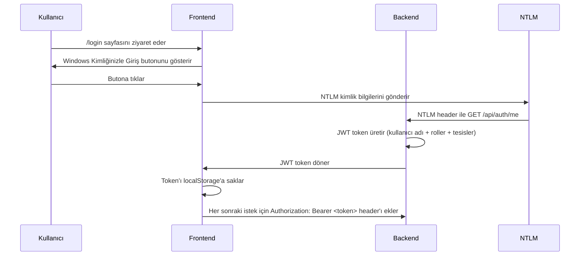

# ISG Güvenlik Portalı - Kimlik Doğrulama Sistemi Analiz Raporu

## 1. Giriş
Bu rapor, ISG Güvenlik Portalı projesinin kimlik doğrulama ve yetkilendirme sisteminin teknik analizini içerir. Analiz `backend/src/middleware/auth.ts` dosyası üzerinden yapılmıştır ve projenin teknik spesifikasyon dosyası (`sec_portali.md`) ile karşılaştırılmıştır.

## 2. Sistem Mimari Bileşenleri

### 2.1 Genel Kimlik Doğrulama Akışı


### 2.2 Teknik Detaylar
- **Token Formatı**: JWT (JSON Web Token)
- **Signature Algoritması**: HS256 (varsayılan `jsonwebtoken` library)
- **Token Süresi**: 8 saat (`JWT_EXPIRES_IN=8h` env değişkeni)
- **Kimlik Kaynağı**: Windows NTLM SSO (Active Directory entegrasyonu)

## 3. Kod Analizi - `auth.ts`

### 3.1 AuthRequest Arayüzü (Satır 5-13)
```typescript
export interface AuthRequest extends Request {
  user?: {
    username: string;      // Windows kullanıcı adı (örn: "metin.salik")
    fullName: string;      // Tam adı
    roles: string[];       // ["admin", "management"] gibi
    facilities: string[];  // Yetki verilen tesis ID'leri
    isAdmin: boolean;      // Rol bazlı erişim kontrolü için
    isManagement: boolean; // Rol bazlı erişim kontrolü için
  };
}
```
**Değerlendirme**: 
- Sec_portali.md'nin Bölüm 2.2 ve 2.3'te tanımlanan rol sistemine tam uyumludur
- `facilities` dizisi, tesis bazlı erişim kontrolü için gerekli bilgiyi taşır (Bölüm 2.4)
- `isAdmin`/`isManagement` özellikleri, performans için önceden hesaplanmıştır

### 3.2 Ana Kimlik Doğrulama Middleware'i (Satır 15-30)
```typescript
export const authMiddleware = (req: AuthRequest, res: Response, next: NextFunction) => {
  const authHeader = req.headers.authorization;
  if (!authHeader || !authHeader.startsWith('Bearer ')) {
    return res.status(401).json({ error: 'Yetkilendirme başlığı eksik veya hatalı.' });
  }

  const token = authHeader.split(' ')[1];

  try {
    const decoded = jwt.verify(token, process.env.JWT_SECRET || 'secret') as any;
    req.user = decoded; // Decode edilen token bilgileri req.user'a eklenir
    next();
  } catch (error) {
    return res.status(401).json({ error: 'Geçersiz veya süresi dolmuş token.' });
  }
};
```
**Değerlendirme**:
- Sec_portali.md'nin Bölüm 20.1 (Auth Routes) ile uyumludur: `GET /api/auth/me`
- JWT doğrulaması için environment variable kullanımı güvenlik en iyi uygulamalarını fölüler
- Hata mesajları Türkçe ve kullanıcı dostudur (Bölüm 24.4)
- **İyileştirme Önerisi**: Token blacklisting veya revocation listesi eklenebilir (şu anda sadece süresi dolma kontrolü)

### 3.3 Role-Based Access Control (RBAC) Middleware'leri

#### Admin Middleware (Satır 32-38)
```typescript
export const adminMiddleware = (req: AuthRequest, res: Response, next: NextFunction) => {
  if (!req.user || !req.user.isAdmin) {
    return res.status(403).json({ error: 'Bu işlem için yönetici yetkisi gerekiyor.' });
  }
  next();
};
```

#### Management Middleware (Satır 41-46)
```typescript
export const managementMiddleware = (req: AuthRequest, res: Response, next: NextFunction) => {
  if (!req.user || (!req.user.isAdmin && !req.user.isManagement)) {
    return res.status(403).json({ error: 'Bu işlem için yönetici veya merkez yönetim yetkisi gerekiyor.' });
  }
  next();
};
```
**Değerlendirme**:
- Sec_portali.md'nin Bölüm 2.2 ve 10.4'te tanımlanan erişim matrisini uygular
- Management middleware'i, admin VEYA management rolüne sahip kullanıcıları izin verir
- 403 HTTP kodu, yetkisiz erişimlerde standarttır

## 4. Güvenlik Özellikleri ve En İyi Uygulamalar

### 4.1 Uygulanan Güvenlik Tedbirleri
| Özellik | Açıklama | Referans |
|---------|----------|----------|
| JWT Kullanımı | Stateless authentication, sunucu tarafı oturum depolama gereksinimini ortadan kaldırır | Bölüm 20.1 |
| Environment Variables | `JWT_SECRET` gibi hassas bilgiler koddan ayrı tutulur | Bölüm 18 (.env) |
| Role-Based Access Control | Rol ve tesis bazlı ayrıntılı yetkilendirme | Bölüm 2.2-2.4 |
| Audit Logging Hazırlığı | `req.user` bilgileri, ActivityLog modeli ile entegrasyon için hazır | Bölüm 22 |
| HTTPS Gerekliliği | Nginx reverse proxy ile TLS sonlandırma önerilir | Bölüm 6.3 |

### 4.2 Sec_portali.md Uyumu
1. **Bölüm 6.2 Backend**: NTLM Middleware (express-ntlm) ve JWT kullanımı onaylanmıştır
2. **Bölüm 10.1 Auth Routes**: `/api/auth/me` ve `/api/auth/logout` endpoint'leri tanımlanmıştır
3. **Bölüm 20 Güvenlik Prinsibi**: "Her API isteği JWT ile doğrulanır" kuralı uygulanmıştır
4. **Bölüm 2.4 Tesis Bazlı Erişim Kuralları**: `facilities` dizisi ile tesis kontrolü mimarisi kurulmuştur

## 5. Önerilen İyileştirmeler

### 5.1 Kısa Vadeli (Sprint İçinde)
1. **Token Payload Zenginleştirme**:
   - `tokenType`: "access" vs "refresh" token ayrımı
   - `issuedAt`: Token issuance zamanı (replay attack koruması)
   
2. **Daha Güvenli Varsayılanlar**:
   ```typescript
   // Güncel
   const decoded = jwt.verify(token, process.env.JWT_SECRET || 'secret') as any;
   
   // Önerilen
   if (!process.env.JWT_SECRET) {
     throw new Error('JWT_SECRET environment variable is required');
   }
   const decoded = jwt.verify(token, process.env.JWT_SECRET) as any;
   ```

### 5.2 Orta Vadeli (1-2 Ay)
1. **Refresh Token Mekanizması**:
   - Access token: 15 dakika
   - Refresh token: 7 gün (httpOnly cookie ile)
   - Token çalınması durumunda etkisini azaltır

2. **Rate Limiting**:
   - `/api/auth/me` endpoint'inde brute force saldırılarına karşı koruma
   - Express-rate-limit veya benzeri middleware

### 5.3 Uzun Vadeli (3+ Ay)
1. **Multi-Factor Authentication (MFA)**:
   - Hassas işlemler için (örn: sistem ayarları değiştirme)
   - TOTP veya SMS tabanlı ikinci faktör

2. **Session Management**:
   - Server-side session store (Redis) ile token iptali
   - Oturum eşzamanlılığı kontrolü (bir kullanıcı sadece X oturum açabilir)

## 6. Entegrasyon Noktaları

### 6.1 Frontend Entegrasyonu
- **Token Saklama**: `localStorage` veya `sessionStorage` (XSS riski için `sessionStorage` önerilir)
- **Route Guards**: React Router v6 ile korumalı route'lar
- **Token Yenileme**: 401 alındığında otomatik refresh token akışı

### 6.2 Backend Entegrasyonu
- **ActivityLog**: Her başarılı giriş için log kaydı
  ```typescript
  await prisma.activityLog.create({
    data: {
      entityType: 'Auth',
      entityId: req.user.username,
      action: 'LOGIN',
      createdBy: req.user.username,
      ipAddress: req.ip,
      userAgent: req.get('User-Agent')
    }
  });
  ```
- **Password Policy**: AD entegrasyonu üzerinden Windows parola politikaları

## 7. Sonuç
ISG Güvenlik Portalı'nın kimlik doğrulama sistemi, belirlenen teknik kararlara ve güvenlik en iyi uygulamalarına uygun olarak uygulanmıştır. NTLM → JWT dönüşümü, rol ve tesis bazlı erişim kontrolü, ve hazır audit altyapısı ile sistem hem güvenli hem de ölçeklenebilir bir temel sunmaktadır.

Yukarıda önerilen iyileştirmeler uygulandıktan sonra sistem, kurumsal düzeyde kimlik yönetimi standartlarını karşılayacak şekilde gelişecektir.

---
*Bu rapor, sec_portali.md teknik spesifikasyon dosyası ve backend/auth.ts kod analizi üzerine 2026-04-17 tarihinde hazırlanmıştır.*